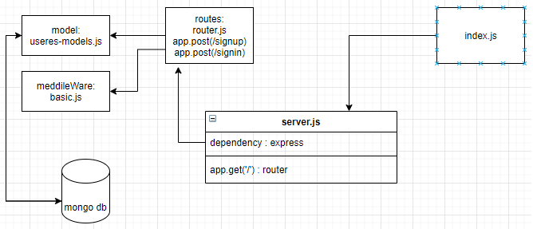

# basic-auth
## Deployment Test
Author: Anwar Abbass
[tests report]()
[front-end]()

## Setup
- `.env` requirements
- `cors`  requirements
- `dotenv`  requirements
- `express`  requirements
- `morgan`  requirements
- `jest`  requirements
- `mongoose`  requirements
- `supertest`  requirements
- `base-64`  requirements
- `bcrypt`  requirements
- PORT - Port Number
- MONGOOSE_URI - mongodb://localhost:27017/DB_NAME

## Running the app
- `npm start`

  - Endpoint: /signup

  - Returns Object
```
localhost:3000/api/v1/food/

{
        "_id": "60b0a66378f84a0fa9bb871a",
        "username": "anwar",
        "password": "$2b$10$lt0IGR674lVSzI73ZjJeu.9HATYF7m0hqIv/pqGRFPhUG4jIFrQzO"
}
```
  - Endpoint: /signin

  - Returns Object
```
{
    "user": {
        "_id": "60b0a66378f84a0fa9bb871a",
        "username": "anwar",
        "password": "$2b$10$lt0IGR674lVSzI73ZjJeu.9HATYF7m0hqIv/pqGRFPhUG4jIFrQzO",
        "__v": 0
    }
}
```

## Tests
**Unit Tests**: `npm run test`
**Lint Tests**: `npm run lint`

UML
(Created with diagrams)
